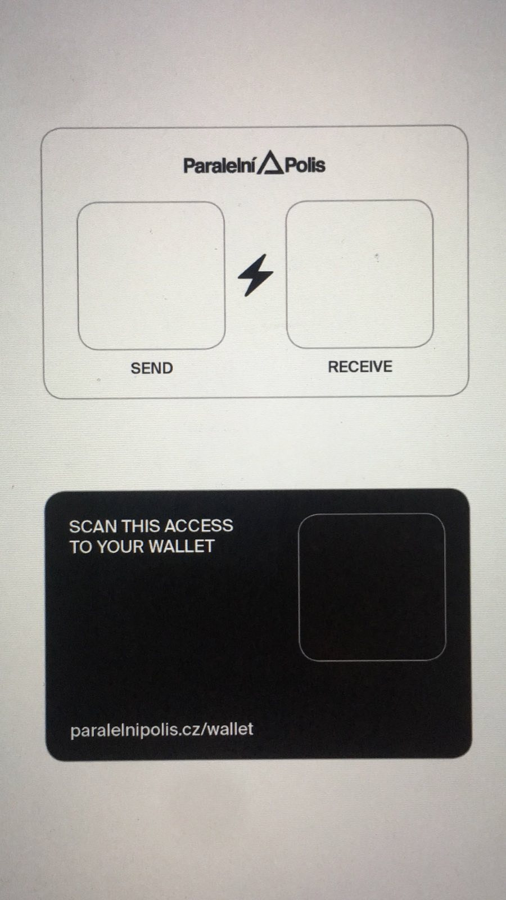

# HCPP2021 Badge

For Hackers Congress Paralelní Polis 2021, we created a payment system which enables Bitcoin Lightning payments using an NFC badge. 
Video example: https://twitter.com/gladstein/status/1444398232692576259

## Previous design, motivation

Card payments in traditional finance have become standard over recent years. They offer easy and conveniently fast payments with certain security tradeoffs. Bitcoin competing with these easy kinds of payments while requiring a phone with a wallet app makes onboarding and daily transactions much harder for many people. Paralelní Polis - Bitcoin Coffee aimed to solve this for ordinary customers and brought the user experience of payment cards to Bitcoin payments years ago. 

The old design uses traditional paper wallets. Either an NFC or QR code with a private key is given to a customer who can use it with ATMs and PoS terminals. For receiving/checking balance device derives pub key from priv key and for payments it takes private key and signs a transaction. Obviously, this comes with strong security and privacy disadvantages. 

Trust is involved in private key generation and devices which read your private key. Constant address reuse also makes this very painful from privacy perspective. These payments were done only on-chain, recently mainly with Litecoin because of fees and compatibility with Bitcoin formats. 

## Lightning badge

Lightning Network solves many of the above problems. Privacy, lower fees, instant settlement and better security can be easily achieved using Bitcoin's native payment network. 

Daily small payments are a perfect use case for LN but it is hard to implement it as card payments. Lightning is interactive protocol and payments cannot be done by simple priv key signing on the base layer. Thankfully, we have LNURL which aims to improve this UX. With LNURL subprotocols, we are able to create an NFC badge/QR card for 'offline' lightning payments. 

### How does it work

NFC badge  contains 2 fields: LNURL-withdraw for paying and LNURL-pay for receiving sats. These are static codes which are created and uploaded only once. To receive funds, user approaches a badge/reads a QR code with LNURL-pay to receive funds from a Bitcoin ATM. Received funds can be immediately spend by reading LNURL-withdraw for example by point of sale terminal. 

LNURL pairs are created using [LNbits](https://github.com/lnbits/lnbits). Each pair represents a user in LNBits instance. With a web address and user ID, user can easily access web interface of the wallet and manage badge funds there.

Yes, this solution is custodial and involves trusting the LNURL server provider. However, compared to the previous model, it offers the same level of trust. Users can easily withdraw all funds to their own non-custodial wallet, which takes minimum fees and is easy thanks to LNBits feature `Drain funds`.
It also offers security benefits because LNURL-withdraw can be limited to a maximum withdrawal amount, number of uses, and time between them. Privacy benefit - avoiding address reuse and not putting all data onchain is obvious.    

Check more general info and recommended practices at paralelnipolis.cz/wallet.

### HCPP badge

Every attendee of the HCPP21 conference received a badge with pre-prepared LNURL codes ready to be used. The badge contains two EEPROM memory modules and two buttons which connect them to the antenna. Data cannot be read unless the button is pushed. The badge design was created by Michael Schloh von Bennewitz, check details at [Monero Devices](https://scm.monerodevices.com/aparat/badge/hcpp20). 


This double memory system is used for separating the withdraw and pay links. Therefore, more security is achieved because while reading pay, no money can be withdrawn. 
LNURL decoding and payment/withdraw needs to be implemented on the side of ATM/PoS. Kudos to General Bytes for pioneering and quickly implementing this concept.

Thanks to this, attendees can simply tap the ATM with their badge, receive money, and immediately pay by tapping the PoS terminal. 

With the badge, attendees also get a paper card that includes LNURL links in the form of QR codes. This can be used with Lightning wallets supporting LNURL but not NFC. 



On the other side of the card is a QR code with a link including a user ID for LNBits instance. Users can open the wallet in their browser, use it as a Lightning wallet via web app, and utilize many of the features offered by LNbits. 

A feature for checking balances at ATM/PoS is also implemented. The description of LNURL-pay includes read key of the user's wallet and the device gets balance by calling the LNbits API. This alters same feature in the old concept where the ATM derives the pub key from the priv key and checks the onchain balance.

## Create your own 

The concept of these badges is built on free and open source tools. Feel free to create your own badges for your own business, event, café...

Different users in LNbits with LNURL pairs can be generated by the API. To create a larger number of wallets for this purpose, use the simple bash script in this repo. 

First, you need to create a wallet in LNbits instance. This will be the main wallet used to create and manage all others. 

Head, e.g. to lnbits.com and create a new wallet. Enable the extension User Manager in Manage extensions. 

Get your user id which can be found in URL:

```
https://lnbits.com/wallet?usr=<ThisIsUserID>
```

And Invoice/read key which is found in API info on home page (wallet). 

Make sure you have dependencies for running the script.
```
apt install curl jq diceware
```

And run script with arguments:

```
./gen_pairs.sh <userID> <read key> <number of wallets to create> <address of LNbits instance>
```

For example:

```
./gen_pairs.sh <string> <string> 10 lnbits.com
```

Creates 10 wallet pairs. Printed output is in format:

```
LNURL-withdraw
LNURL-pay
Link to wallet
```

This output can also be in the created file `badges` and all information about created wallets is in the file `wallets`. 

The script calls the User manager extension in the wallet you manually created, which creates new wallets, enables extensions, and creates payment links. In LNURL-withdraw it allows withdraw up to 100k sats with maximum 100 uses once per 10 seconds. For LNURL-pay, it allows to receive up to 4m sats and puts the read key of wallet to LNURL description for checking the balance feature. It is pretty simple, edit it to match your needs. 

You can use the open source design of the badge by Monero devices (above), any NFC card, or just create QR codes and make payments by scanning them. 

Come visit Paralelní Polis in Prague to try it in the wild! 
